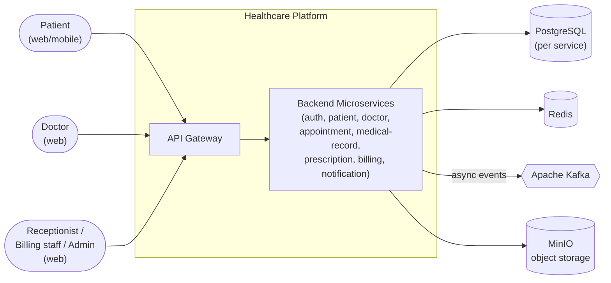
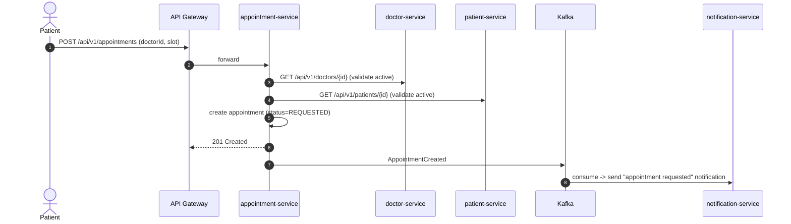
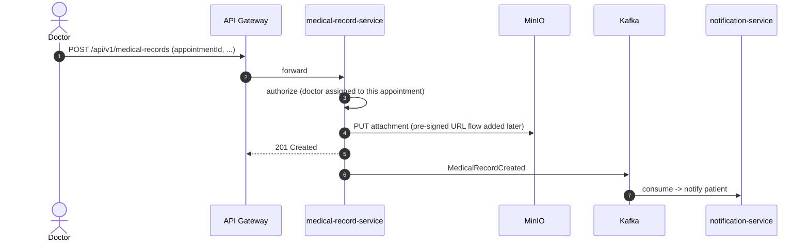

# Architecture

This document describes the high-level architecture of the Healthcare Hospital Operations Platform: containers, cross-cutting concerns, and the rationale for major decisions.

> For per-service responsibilities and contracts, see [`service-boundaries.md`](service-boundaries.md).
> For data ownership, see [`database-design.md`](database-design.md).
> For eventing, see [`events.md`](events.md).

---

## 1. Goals and non-goals

### Goals

- Strong isolation between clinical and administrative domains.
- Least-privilege access to patient medical information.
- Independently deployable, scalable, and replaceable services.
- Predictable asynchronous workflows for notifications, billing, and audit.
- Replaceable front-end (Angular) talking only to the API gateway.

### Non-goals (for the foundation phase)

- Full observability stack (Prometheus, Grafana, OTel, centralized logging) — prepared for, not implemented.
- Cloud-native deployment artifacts (Kubernetes manifests, Terraform).
- High availability / multi-region.
- Full HIPAA / GDPR compliance certification work (controls are designed in, but the certification process is out of scope for engineering foundation).

---

## 2. Context (C4 level 1)



All external traffic enters the platform through the **API gateway**, which authenticates, authorizes at the edge, and routes to internal services.

---

## 3. Container view (C4 level 2)

```mermaid
flowchart TB
    subgraph Edge
      GW["api-gateway<br/>Spring Cloud Gateway<br/>JWT validation, rate limit, CORS"]
    end

    subgraph Core["Domain services"]
      AUTH["auth-service<br/>(users, roles, refresh tokens)"]
      PAT["patient-service"]
      DOC["doctor-service"]
      APP["appointment-service"]
      MR["medical-record-service"]
      RX["prescription-service"]
      BILL["billing-service"]
      NOT["notification-service"]
    end

    subgraph Infra["Infrastructure"]
      PG_AUTH[("auth_db")]
      PG_PAT[("patient_db")]
      PG_DOC[("doctor_db")]
      PG_APP[("appointment_db")]
      PG_MR[("medical_record_db")]
      PG_RX[("prescription_db")]
      PG_BILL[("billing_db")]
      PG_NOT[("notification_db")]

      RD[("Redis<br/>token blacklist,<br/>rate-limit counters,<br/>hot cache")]
      KF{{"Kafka<br/>3 brokers (dev: 1)"}}
      MN[("MinIO<br/>attachments bucket")]
    end

    GW -->|REST + JWT| AUTH
    GW --> PAT
    GW --> DOC
    GW --> APP
    GW --> MR
    GW --> RX
    GW --> BILL

## 4. Cross-cutting concerns

### 4.1 Authentication

- `auth-service` issues JWT access tokens and refresh tokens.
- Access tokens are short-lived (default 15 min). Refresh tokens are long-lived (default 14 days) and rotated on every use.
- The **API gateway** is the single place that validates JWTs on incoming requests and forwards a trusted, normalized principal header to downstream services (so services do not need to verify signatures themselves in the common case).
- Internal service-to-service calls that cross trust boundaries (e.g., `appointment-service` → `patient-service` to validate an ID) re-validate the JWT in the target service when sensitive data is touched.
- A token blacklist (deny-list) lives in Redis for logout and forced revocation.

### 4.2 Authorization

- RBAC with the initial roles: `PATIENT`, `DOCTOR`, `ADMIN`, `RECEPTIONIST`, `BILLING_STAFF`.
- Roles are stored in `auth_db` and embedded as a claim in the JWT.
- Resource-ownership checks happen **inside the service** that owns the resource. The gateway performs coarse-grained role checks; the service performs fine-grained checks (e.g., "this patient ID matches the principal").

### 4.3 Data classification

| Class                       | Examples                                | Access                              |
|-----------------------------|-----------------------------------------|-------------------------------------|
| Highly sensitive (clinical) | Diagnoses, prescriptions, attachments   | Patient (self only), assigned doctor, admin (with audit) |
| Sensitive (PII)             | Full name, contact, insurance           | Patient (self), doctor (for booked appointments), receptionist, admin |
| Operational                 | Appointments, invoices                  | Patient (self), doctor (self), billing staff (invoices only), receptionist, admin |
| Public / internal           | Doctor specialty, doctor name           | Authenticated users                 |

### 4.4 Validation

- All incoming DTOs are validated with Bean Validation (`@Valid`, `@NotNull`, etc.).
- Custom validators for medical record fields (ICD-10 code format, dosage format) are added per service.

### 4.5 Error handling

- A single `GlobalExceptionHandler` per service produces a consistent error envelope (see [`api-design.md`](api-design.md)).

### 4.7 Observability foundation

- Each service exposes Spring Boot Actuator endpoints: `/actuator/health`, `/actuator/info`, `/actuator/prometheus`.
- Health groups split into liveness and readiness.
- A Micrometer registry is included so Prometheus scraping will work in the observability phase with no code changes.
- OpenTelemetry SDK is **not** wired yet but all log lines carry `service.name`, `trace.id` (correlation), and `span.id` placeholders to make the future OTel cutover cheap.

### 4.8 Transactions

- Database transactions are confined to a single service boundary.
- Cross-service state is propagated by events; consumers must be **idempotent** (event ID + processed-events table or idempotency keys).
- `saga`-style coordination (e.g., appointment → invoice → notification) is **not** used in the foundation; we rely on the outbox pattern (added when `billing-service` lands) for reliable event publishing.

### 4.9 Rate limiting

- Token-bucket rate limiting at the gateway using Redis (`bucket4j-redis` or a gateway filter).
- Default per-IP and per-user limits; per-endpoint overrides for auth (login, refresh) to mitigate brute force.

### 4.10 Secrets management

- No secrets in source. Each service reads configuration from environment variables.
- A `.env.example` (added in phase 12) lists every required variable name; real values come from `.env` (git-ignored) locally, and from a secret manager in later phases.
- Spring profiles: `local`, `dev`, `prod`. The default profile is `local`.

---

## 5. Key design decisions

| Decision                                         | Choice                                     | Why                                                                                             |

## 6. Workflows (sequence diagrams)

### 6.1 Patient self-registration

```mermaid
sequenceDiagram
    autonumber
    actor U as Patient
    participant GW as API Gateway
    participant AU as auth-service
    participant PA as patient-service
    participant K as Kafka

    U->>GW: POST /api/v1/auth/register (email, password, ...)
    GW->>AU: forward
    AU->>AU: BCrypt hash, create user, role=PATIENT
    AU-->>GW: 201 Created (userId)
    AU->>K: publish UserRegistered(userId, role)
    K->>PA: consume UserRegistered
    PA->>PA: create patient profile (status=PENDING)
    PA-->>U: (later) /me returns profile
```

### 6.2 Booking an appointment



### 6.3 Creating a medical record after a confirmed appointment



---

## 7. Failure handling

- **Service down:** Gateway returns `503 SERVICE_UNAVAILABLE`; clients retry with exponential back-off.
- **Kafka down for producer:** Producer is blocked (synchronous send with timeout) so the calling transaction fails and the user sees an error. A future phase adds an outbox table for reliable publishing.
- **Kafka down for consumer:** Consumer retries with back-off; after N attempts the event goes to a dead-letter topic for manual inspection.
- **DB down:** Service returns `503`; health endpoint goes `DOWN`.
- **Idempotency:** All Kafka consumers use the event ID for deduplication.

---

## 8. Open architectural questions

These are intentionally **not** decided at the foundation phase. They will be revisited when the relevant service is built or when the cloud phase begins.

1. **Outbox vs. direct Kafka publish** — confirm outbox pattern in `appointment-service` and `billing-service` once those services are in scope.
2. **Cross-service reads for validation** — should `appointment-service` call `patient-service` and `doctor-service` on every booking, or should `auth-service` enrich the JWT with `patientId` / `doctorId` claims at login time to avoid the round-trip?
3. **Token introspection** — for service-to-service calls without a user JWT, do we use a service-account JWT or mTLS?
4. **Attachment encryption at rest** — MinIO supports SSE-KMS; we will enable it in the cloud phase.
5. **PHI in logs** — the logging policy forbids PHI in logs; we will add a logging-side filter to scrub anything that looks like an ICD-10 code or a dosage during the security hardening phase.
6. **Single-tenant vs. multi-tenant** — the foundation assumes single-tenant. Multi-tenant (multiple hospitals on one platform) is **not** in scope but the schema is designed to allow a future `tenant_id` column without breaking changes.

---

## 9. Cross-references

- Service responsibilities: [`service-boundaries.md`](service-boundaries.md)
- Database design: [`database-design.md`](database-design.md)
- API conventions: [`api-design.md`](api-design.md)
- Events: [`events.md`](events.md)
- Roadmap: [`development-roadmap.md`](development-roadmap.md)

|--------------------------------------------------|--------------------------------------------|--------------------------------------------------------------------------------------------------|
| Service style                                    | Microservices with DB-per-service          | Independent deployability and clean failure boundaries.                                          |
| Communication                                    | REST + Kafka                               | REST for synchronous reads, Kafka for asynchronous workflows.                                    |
| Auth at the edge                                 | API gateway validates JWT                  | Removes duplicated JWT verification code from every service.                                     |
| Authorization enforcement                        | Inside each service                        | Resource ownership requires per-resource data; cannot be done correctly at the gateway alone.     |
| Database                                         | PostgreSQL per service                     | Strong consistency per service, mature tooling, supports JSONB for flexibility.                   |
| Migrations                                       | Flyway                                     | Versioned, reviewable, runs in CI/CD.                                                            |
| Identifiers                                      | UUIDv4                                     | No leaking of internal sequence counts; safe to log partial UUIDs.                               |
| Caching                                          | Redis                                      | Token blacklist, rate-limit counters, hot patient/doctor lookups.                                |
| Object storage                                   | MinIO                                      | S3-compatible, can be swapped for S3 / GCS in cloud phase with no API change.                    |
| Notification delivery                            | In-app + email (initial)                   | SMS / push deferred to a later phase.                                                            |
| Frontend                                         | Angular                                    | Per project requirements.                                                                        |
| Container build                                  | Per-service Dockerfiles (phase 12)         | Independent images.                                                                              |

---

- Stack traces are logged at `ERROR` but never returned to clients.
- Validation errors map to `400 VALIDATION_ERROR`; missing resources to `404 NOT_FOUND`; auth failures to `401 UNAUTHORIZED`; permission failures to `403 FORBIDDEN`; conflicts to `409 CONFLICT`.

### 4.6 Logging

- Structured JSON logs (Logback with `logstash-logback-encoder`).
- Every request gets a correlation ID (`X-Correlation-Id`) generated at the gateway and propagated to all downstream calls (HTTP header + Kafka header).
- The following are **never** logged at any level:
  - passwords
  - raw JWTs or refresh tokens
  - full medical-record bodies (only IDs and action types)
  - PAN / payment card data (handled later with a real PCI-compliant processor)

    GW --> NOT

    AUTH --> PG_AUTH
    PAT  --> PG_PAT
    DOC  --> PG_DOC
    APP  --> PG_APP
    MR   --> PG_MR
    RX   --> PG_RX
    BILL --> PG_BILL
    NOT  --> PG_NOT

    AUTH --- RD
    GW   --- RD

    AUTH -.->|UserRegistered<br/>UserDeactivated| KF
    PAT  -.->|PatientCreated<br/>PatientUpdated| KF
    DOC  -.->|DoctorCreated<br/>DoctorUpdated| KF
    APP  -.->|AppointmentCreated/Confirmed<br/>Cancelled/Completed| KF
    MR   -.->|MedicalRecordCreated| KF
    RX   -.->|PrescriptionCreated| KF
    BILL -.->|InvoiceCreated<br/>PaymentCompleted| KF
    NOT  -.->|NotificationRequested<br/>NotificationDelivered| KF

    MR --> MN
```

Every service owns its own PostgreSQL database. Cross-service reads are via REST, cross-service state propagation is via Kafka.
